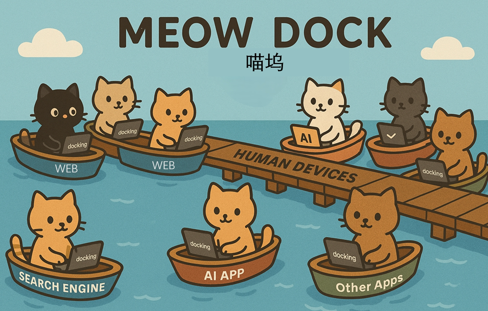

# 喵坞 Meow Dock 🐈🚢
<p align="center">
  
</p>

中文版 | [English](README_EN.md)

<!-- 可选：在此处添加 Logo -->
<!-- 可选：在此处添加徽章，例如： -->
<!--  -->
[](https://opensource.org/licenses/Apache-2.0)

**为99%个人端侧设备提供无需GPU卡，无需额外购买API算力，低延迟，高稳定性的端侧设备操作工具。**

## 解决的问题

我们的目标是，将个人端侧设备的常用操作（e.g. 进行网络搜索后输入AI软件提问）封装成**稳定，低延迟，无需GPU卡**的模块化组件（MCP或函数），从而打通AI与终端设备操作的最后一公里路程。

## 目标用户

本项目主要服务于 **从事 Agent、工作流自动化和其他端侧设备操作场景的个人开发者和企业。**。

## 功能与特性 ✨

*   **功能：** 调用一行python命令，即可实现网站/软件操作。目前支持：百度搜索与元宝问答
*   **特点：** 
*    (1). 对我们支持的网站/软件操作均使用CPU完成操作，不需要调用GPU或者第三方大语言模型API，响应速度更快
*    (2). 用户不需要额外购买API等算力资源，用户无需额外花费，经济实惠
*    (3). 相比纯云端方案，通过本地化可以更好的保持隐私性


## 安装 🛠️

**从源码安装**

1.  **克隆仓库：**
    ```bash
    git clone https://github.com/pseudo-longinus/meow-dock.git     # 打开一个命令行（windows cmd或者powershell），使用命令克隆代码
    cd meow-dock  # 进入文件夹
    ```

2.  **创建虚拟环境，需要 Python>=3.12 :**
    ```bash
    python -m venv .venv        # 创建一个虚拟环境
    .venv\Scripts\activate      # 如果是Windows环境，使用这个命令激活
    #source .venv/bin/activate  # 如果是Linux/macOS环境，使用这个命令激活
    ```

3.  **安装依赖和项目：**
    ```bash
    pip install -e . -i https://mirrors.aliyun.com/pypi/simple/ --trusted-host mirrors.aliyun.com
    ```


## 例子1：向元宝请求个冷笑话，并获得返回结果 🚀

```python
from meowdock.docking.docking_factory import DockingFactory
from meowdock.cmd.login.main import login
import sys


def main():
    # 如果是第一次使用，需要先登录腾讯元宝，登录之后，关闭浏览器，程序才会继续执行
    login(urls=["https://yuanbao.tencent.com/chat/"])

    prompt = "给我讲一个冷笑话"
    print(f"Executing with Yuanbao using prompt: '{prompt}'...")
    # 使用DockingFactory获取yuanbao的docking实例
    factory = DockingFactory()
    yuanbao_docking = factory.get_docking("yuanbao")
    # 使用docking的run方法执行prompt
    result = yuanbao_docking.run(prompt)
    print(result)

if __name__ == "__main__":
    main()

```

# 例子2: 搜索后总结
```python
from meowdock.docking.docking_factory import DockingFactory
from meowdock.cmd.login.main import login


def main():
    # 当登录失效时，需要使用login.py进行登录。
    # login(urls=["https://yuanbao.tencent.com/chat/"])
    # 定义参数
    search_query = "黄金为什么涨"
    search_engine = "baidu"

    try:
        # 初始化工厂并获取docking实例
        factory = DockingFactory()
        # 获取搜索docking实例
        search_docking = factory.get_docking(search_engine)
        print(f"Searching for '{search_query}' using {search_engine}...")
        search_results = search_docking.run(search_query)
        if not search_results:
            print("No search results found.")
            return
        print("search_results:", search_results)
        yuanbao_docking = factory.get_docking("yuanbao")
        # 用元宝处理搜索结果
        print("Processing search results with AI...")
        combined_prompt = f"Please summarize the key points about {search_query} based on these search results:\n\n{search_results}"
        analysis_result = yuanbao_docking.run(combined_prompt)

        # 显示分析结果
        print("\nAnalysis result:")
        print("-" * 40)
        print(analysis_result)
        print("-" * 40)

    except Exception as e:
        print(f"Error: {e}")
        
if __name__ == "__main__":
    main()
```

## 项目结构 🏗️

```.
├── meowdock/           # 核心库代码
│   ├── __init__.py
│   ├── main.py         # 命令行入口
│   ├── agent/          # 组合命令相关模块
│   ├── cmd/            # 存放各个命令的具体实现
│   │   ├── search/     # 搜索命令相关模块
│   │   ├── fetch/      # 网页获取模块
│   │   ├── execute/    # 执行命令模块
│   │   └── login/      # 登录模块
│   ├── config.py       # 配置管理
│   ├── library/        # 通用库或辅助函数
│   └── resources/      # 资源文件（xpath配置等）
├── setup.py            # 项目安装配置
├── LICENSE             # Apache 2.0 许可证
└── README.md           # 说明文件
```

## FAQ 🗂️

1. 需要登录网站吗？
是的，您需要的。因为程序使用了自己的browser，所以您需要运行login.py进行登录，而不是直接从常用浏览器登录。 我们接下来会开发更好用的登录管理模块。

2. 目前支持哪些网站？
目前支持元宝和百度搜索，会陆续增加网站。您可以将您希望增加的支持网站发给我们，填写在这里：

https://docs.qq.com/form/page/DWU9rZU5nTVFqT0JN


3. 为什么会无法使用？
可能是目标网站/软件的界面或者版本发生变化，您可以尝试拉取更新后再次尝试：
```bash
git pull origin main
```

如果仍然遇到问题，请将日志文件log\executor\xxx.zip，提交到issue或者发送邮件到guanzhao3000@gmail.com， 我们会分析失败原因并优化代码。


## 许可证 📄

本项目开源代码库对应community版本，采用 [Apache License 2.0](LICENSE) 授权。

## Third-party Code and License Compliance

This project includes code derived from the [browser-use](https://github.com/browser-use/browser-use) project, which is licensed under the MIT License. See LICENSE.browser-use for details.


